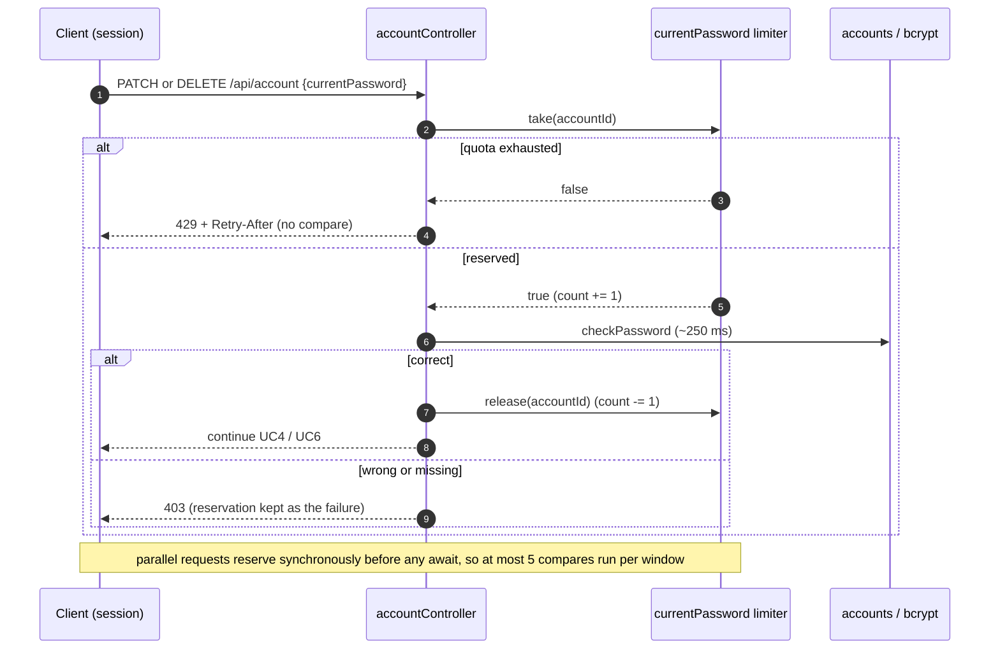

# Sequence — current-password check with reservation (#329)

Spec: [current-password-reservation](../../specs/current-password-reservation.md), rules R1–R3.

```mermaid
sequenceDiagram
  autonumber
  participant C as Client (session)
  participant A as accountController
  participant L as currentPassword limiter
  participant DB as accounts / bcrypt
  C->>A: PATCH or DELETE /api/account {currentPassword}
  A->>L: take(accountId)
  alt quota exhausted
    L-->>A: false
    A-->>C: 429 + Retry-After (no compare)
  else reserved
    L-->>A: true (count += 1)
    A->>DB: checkPassword (~250 ms)
    alt correct
      A->>L: release(accountId) (count -= 1)
      A-->>C: continue UC4 / UC6
    else wrong or missing
      A-->>C: 403 (reservation kept as the failure)
    end
  end
  Note over C,L: parallel requests reserve synchronously before any await, so at most 5 compares run per window
```
