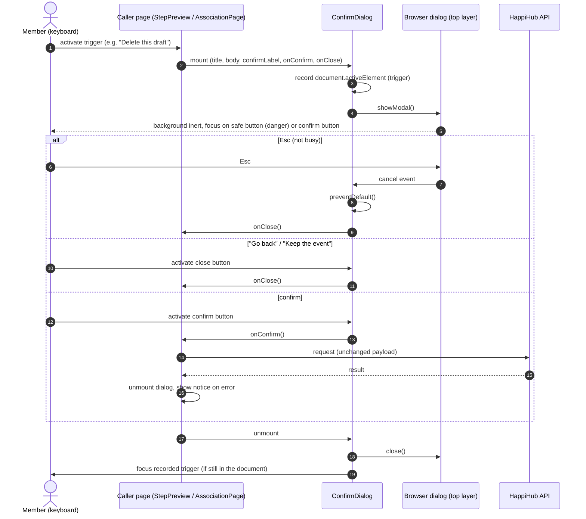

# Sequence — opening, dismissing and confirming a modal confirmation (#346)

Spec: [modal-confirmation-dialog](../../specs/modal-confirmation-dialog.md), rules R1–R4, R8.

```mermaid
sequenceDiagram
  autonumber
  actor M as Member (keyboard)
  participant P as Caller page (StepPreview / AssociationPage)
  participant D as ConfirmDialog
  participant B as Browser dialog (top layer)
  participant API as HappiHub API
  M->>P: activate trigger (e.g. "Delete this draft")
  P->>D: mount (title, body, confirmLabel, onConfirm, onClose)
  D->>D: record document.activeElement (trigger)
  D->>B: showModal()
  B-->>M: background inert, focus on safe button (danger) or confirm button
  alt Esc (not busy)
    M->>B: Esc
    B->>D: cancel event
    D->>D: preventDefault()
    D->>P: onClose()
  else "Go back" / "Keep the event"
    M->>D: activate close button
    D->>P: onClose()
  else confirm
    M->>D: activate confirm button
    D->>P: onConfirm()
    P->>API: request (unchanged payload)
    API-->>P: result
    P->>P: unmount dialog, show notice on error
  end
  P->>D: unmount
  D->>B: close()
  D->>M: focus recorded trigger (if still in the document)
```
