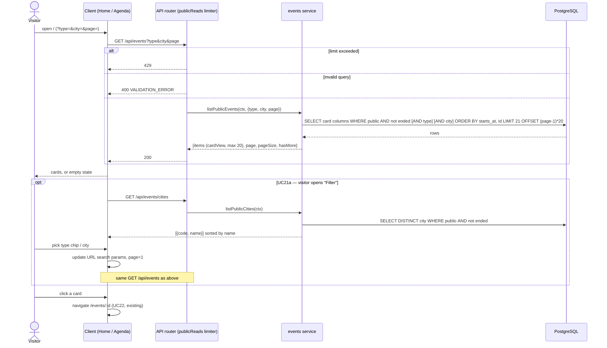

# Sequence diagram — public-agenda — browse and filter the agenda

> **Source spec**: [public agenda](../../specs/public-agenda.md) § 2–4 (AC1–AC11)

Status: validated by Benoît on 2026-10-26.

```mermaid
sequenceDiagram
  actor V as Visitor
  participant C as Client (Home / Agenda)
  participant R as API router (publicReads limiter)
  participant S as events service
  participant DB as PostgreSQL

  V->>C: open / (?type=&city=&page=)
  C->>R: GET /api/events?type&city&page
  alt limit exceeded
    R-->>C: 429
  else invalid query
    R-->>C: 400 VALIDATION_ERROR
  else
    R->>S: listPublicEvents(ctx, {type, city, page})
    S->>DB: SELECT card columns WHERE public AND not ended [AND type] [AND city] ORDER BY starts_at, id LIMIT 21 OFFSET (page-1)*20
    DB-->>S: rows
    S-->>R: {items (cardView, max 20), page, pageSize, hasMore}
    R-->>C: 200
  end
  C-->>V: cards, or empty state
  opt UC21a — visitor opens "Filter"
    C->>R: GET /api/events/cities
    R->>S: listPublicCities(ctx)
    S->>DB: SELECT DISTINCT city WHERE public AND not ended
    S-->>C: [{code, name}] sorted by name
    V->>C: pick type chip / city
    C->>C: update URL search params, page=1
    Note over C,R: same GET /api/events as above
  end
  V->>C: click a card
  C->>C: navigate /events/:id (UC22, existing)
```
