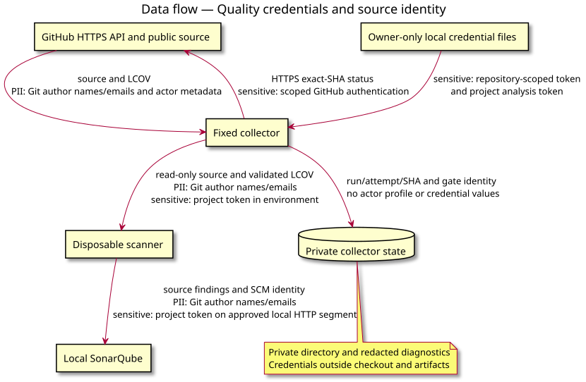

# 05 data flow — Local collector

Status: clarification of the owner-approved algorithm, no new behavior.
**Superseded by [ADR-0005](../../decisions/0005-local-first-ci.md) on 2026-11-10** (#410: collector removed).
Source: [collector conception](../../specs/sonarqube-local-collector.md).

This is a complementary data-flow view, not a native UML diagram. Credential and public SCM identity boundaries are explicit.
