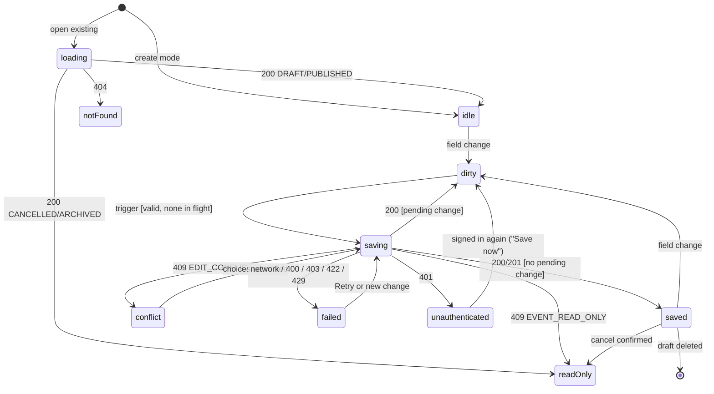

# State diagram — v1-event-client — Editor save status

> **Source spec**: [client event workflow](../../specs/v1-brick-b-client-event-workflow.md) § 3

Status: validated by Benoît on 2026-10-22.

```mermaid
stateDiagram-v2
  [*] --> loading : open existing
  [*] --> idle : create mode
  loading --> idle : 200 DRAFT/PUBLISHED
  loading --> readOnly : 200 CANCELLED/ARCHIVED
  loading --> notFound : 404
  idle --> dirty : field change
  saved --> dirty : field change
  dirty --> saving : trigger [valid, none in flight]
  saving --> saved : 200/201 [no pending change]
  saving --> dirty : 200 [pending change]
  saving --> conflict : 409 EDIT_CONFLICT
  conflict --> saving : choices submitted
  saving --> failed : network / 400 / 403 / 422 / 429
  failed --> saving : Retry or new change
  saving --> unauthenticated : 401
  unauthenticated --> dirty : signed in again ("Save now")
  saving --> readOnly : 409 EVENT_READ_ONLY
  saved --> readOnly : cancel confirmed
  saved --> [*] : draft deleted
```
